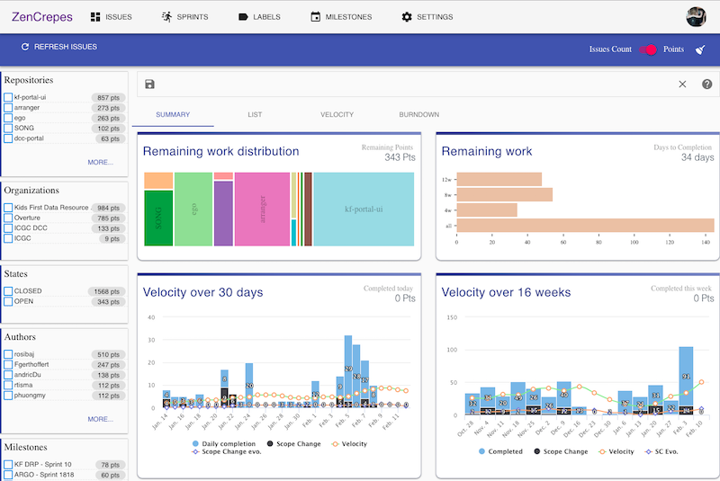
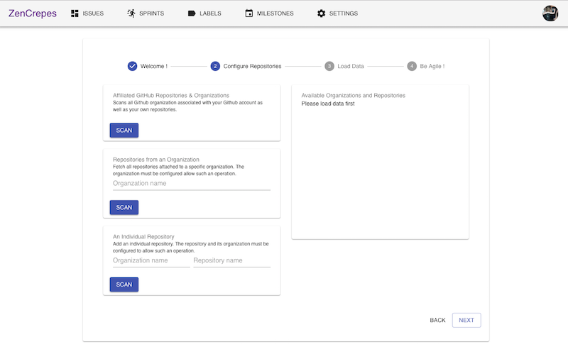
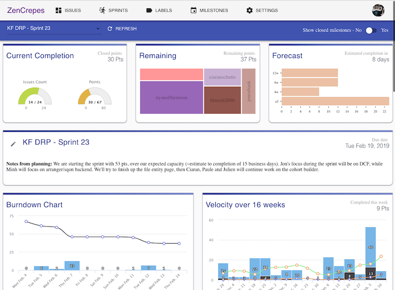
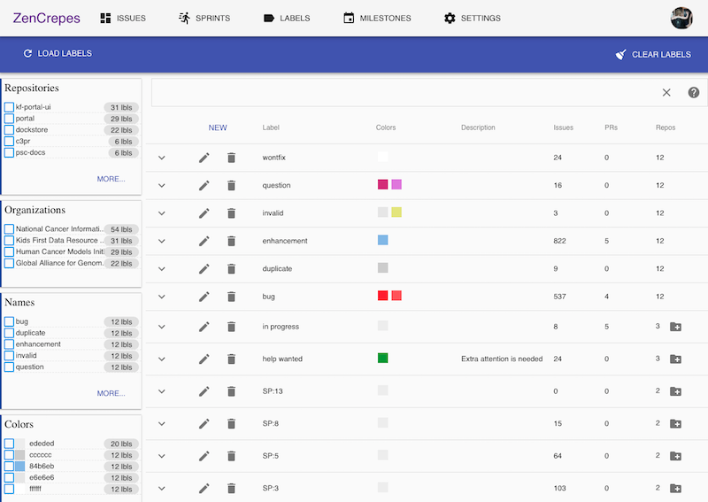
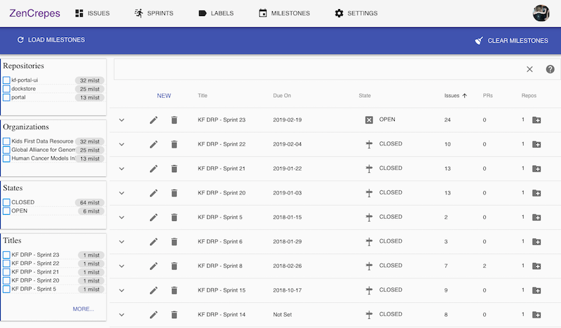
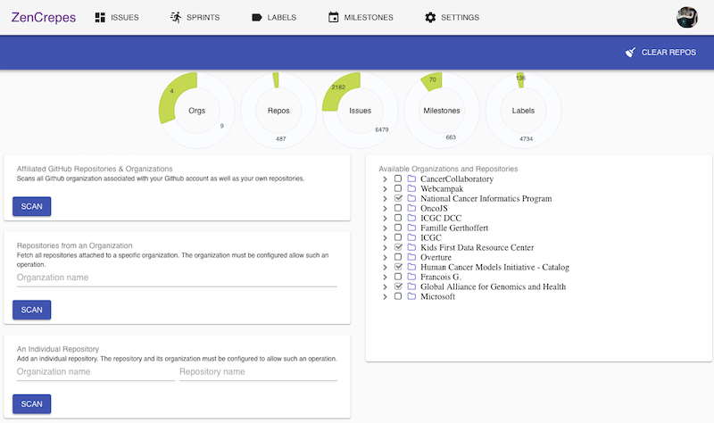
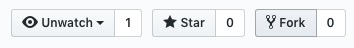
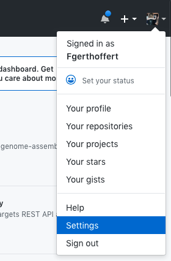
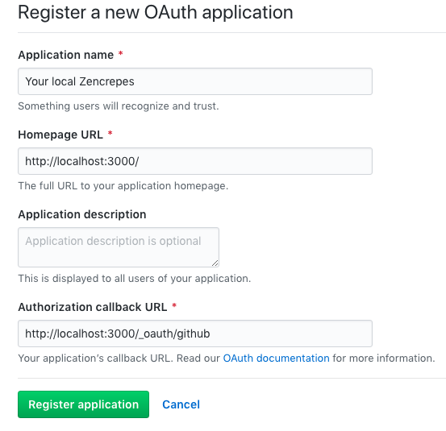

[](https://circleci.com/gh/Fgerthoffert/zencrepes/tree/master) [](http://slack.overture.bio)


<h1 align="center"> Zencrepes </h1><br>

<p align="center">
Agile analytics and management across GitHub organizations & repositories made easy!
</p>

<p align="center">
  <a href="https://zencrepes.io" target="_blank"></a>
</p>

## Table of Contents

* [Introduction](#introduction)
* [How it Works](#how-it-works)
* [Try-it](#try-it)
* [What's Next ?](#whats-next-)
* [Overview](#overview)
    * [Wizard](https://github.com/Fgerthoffert/zencrepes/tree/develop#wizard)
    * [Velocity](https://github.com/Fgerthoffert/zencrepes/tree/develop#velocity)
    * [Staging Changes](#staging-changes)
    * [Issues Screen](#issues-scree)
    * [Sprints Screen](#sprints-screen)
    * [Labels Screen](#labels-screen)
    * [Milestones Screen](#milestones-screen)
    * [Settings Screen](#settings-screen)
* [Contribute](#contribute)
* [Reach-out](#reach-out)


## Introduction

ZenCrepes has been created by a PM (excuse the poor programming) to facilitate project management for teams operating solely over GitHub issues, and across multiple organizations & repositories.

It focuses on three primary objectives:
* __Report and search__: Quickly find relevant issues based on selected criteria (faceted search). For example `List open defects assigned to John or Max in rock or paper repos` or `Display the team's velocity on paper and scissor repos`.
* __Scrum operation__: Identify the amount of work left in a sprint, estimate completion based on past velocity, review repartition of open issues (by repo, by labels, by assignees).
* __Consistency__: Ensure labels and milestones are consistent across multiple organizations and repositories, clean-up when necessary.

## How it works

ZenCrepes is entirely client-side by choice. The main concept around using ZenCrepes is not to introduce any dependencies to third-party services. Users have the option to operate directly with GitHub's UI or to use ZenCrepes. It also means that ZenCrepes cannot see any user data, once authenticated, all data exchanges are directly made between the user's browser and GitHub.

But this approach has two major drawbacks:
* ZenCrepes cannot register to GitHub hooks, therefore cannot be `informed` about updates. Instead, it needs to regularly pull for changes.
* Since the database (Minimongo) is entirely client-side and bound to the browser's capabilities, the more data there is, the slower ZenCrepes is going to be. A few thousands of issues should be perfectly fine though.

## Try-it!

Just go to https://zencrepes.io and log-in. It's all client-side, so not a chance we'll see your data. 

## What's Next?
_(and a quick note from the Author)_

In its current state, ZenCrepes is really more a proof-of-principle app than something with a proper design and correct implementation. Nevertheless, it does work, and already greatly simplifies agile management for my teams.

When starting ZenCrepes, the vision was to create an app sitting entirely on top of GitHub API, without needing any additional metadata stored elsewhere. The point was not to create a competitor to ZenHub or Waffle but to remove the need from using those. To give developers (and the team as a whole) the choice between updating their issues directly in GitHub or through an app (like ZenCrepes), both options achieving the same result.

Finally, ZenCrepes is OpenSource with the hope that getting people interested in the app will encourage contribution to its codebase. Getting a community of contributors to help build the necessary improvements, to hopefully get to an open platform built by team managers for team managers.

## Overview

The section below will provide an overview of ZenCrepes main screens.

### Wizard

When opening-up ZenCrepes for the first time, a short configuration wizard is presented, it provides general explanations and allows users to select repositories to load data from.

<p align="center">
  
</p>

ZenCrepes can automatically fetch repositories affiliated with the user, but it can also fetch data from public organizations and repositories, as long as they are configured to allow such action. Some that do are JetBrains, Microsoft (individual repositories, for example, cntk), elastic...

## Velocity

Velocity is an interesting metric, it gives a sense of a team's pace and potentiality to meet certain deadlines. But velocity metrics are not the single mean of estimating, it is one of the many elements to be used when planning and forecasting.

In most of its screens, ZenCrepes uses weekly velocity calculated on 4 weeks rolling average from the last data point. For example, the velocity of week 4 is the (W1+W2+W3+W4)/4 (yes it does include the current week).

ZenCrepes will also try to forecast how much time is needed to complete a set of open issues. The forecast will usually display 4 values:

* using average velocity over the entire project
* using average velocity over the past 12 weeks
* using average velocity over the past 8 weeks
* using average velocity over the past 4 weeks (default)

Variation in the displayed average also gives interesting indications whether the team has a steady pace, is accelerating or slowing down...

But again, understand what you are asking the metrics to provide.

Finally, when planning a new sprint, velocity is calculated as a sum of all of the individual contributors' past velocities across all past issues. As explained above, understand the implications of such a statement.

### Staging changes

There are no backups of GitHub's content, so if you perform an action by mistake (like deleting a wrong Milestone), you are going to lose data. To make everything a bit safer, before pushing any changes, ZenCrepes does show you a list of all the changes, per repositories, that are about to be sent to GitHub's API.

During that stage, ZenCrepes is also going to query each of the individual elements to pull their latest version from GitHub, this prevents overwriting content by mistake if you operate with an outdated local cache. If an individual node updatedAt value is different between your local browser and GitHub, you will not be able to submit those changes. You will have to either remove this node from the list of changes or close the screen and perform the modification again. Again, all of this to prevent accidental modifications!

### Issues Screen

The objective of the `Issues` view is to quickly filter down issues using faceted search and see metrics resulting from a particular set of issues.

<p align="center">
  
</p>

Notice the switch `Issues Count` vs `Story Points` at the top of the screen. Story Points is the default, but the system will automatically fall back to Issues Count if no points were found. It's inaccurate but could still give relevant insights.

### Sprints Screen

The objective of the `Sprints` view is to provide close-up insights into a particular sprint while supporting the team during scrum meetings.

<p align="center">
  
</p>

This screen contains the following:
* Completion status in terms of ticket counts and Points
* Breakdown of remaining points by an assignee
* Estimated Completion using various velocity metrics
* Markdown-style sprint notes
* Burndown chart for the current sprint
* Team velocity over the past 16 weeks
* List of issues
* Breakdown of issues count and points by assignees
* Breakdown of issues count and points by milestones
* Breakdown of issues count and points by labels

Since ZenCrepes cannot automatically be informed about changes in GitHub, an auto-refresh feature is available. Once enabled, it refreshes issues from all milestones (see the milestone table at the bottom of the screen) every 2 minutes, for 20 occurrences (so about 40mn total). Then the user has to re-activate auto-refresh.

### Labels Screen

The objective of the `Labels` view is to simplify management of labels across organizations and repository. Easily push a single label to 10s of repositories, easily apply a consistent color for one label across multiple repositories, ...

<p align="center">
  
</p>

Modifications are bound to the query being applied, for example, if you select repo A & B, modifying or creating a label, will be bound to those 2 repositories only.

### Milestones Screen

An almost identical approach than Labels but for GitHub milestones.

<p align="center">
  
</p>


### Settings Screen

The settings view allows users to select which repository to load data from. It shows the same screens than the configuration wizard.

<p align="center">
  
</p>


## Contribute

ZenCrepes is just at the beginning of its adventure, and contributions guidelines will evolve over time. For now, just submit a PR into its codebase. This PR will have to pass circle-ci tests (which is just linting and build).

If successful the PR will be merged into `develop`, from there it gets automatically deployed to a dev environment (https://dev.zencrepes.io) for further manual testing of the feature. If all is good, then a PR is created against `master` and merged. Master then get automatically deployed (https://zencrepes.io).

### Develop ZenCrepes locally.

But first, you need to be able to run ZenCrepes in your local dev environment. The instructions below are going to be for Mac but should be very similar to other environments.

#### Fork and Clone ZenCrepes repository

In GitHub, create a fork of ZenCrepes' repository into your own profile.

<p align="center">
  
</p>

Once done, clone the forked repository locally (replace the URL below with your fork).

```bash
git clone git@github.com:Fgerthoffert/zencrepes.git
```

#### Install dependencies

Once done, cd into the repo's directory and install the required dependencies.

```bash
# Download and install Meteor
curl https://install.meteor.com | /bin/sh
# Install the dependencies
meteor npm install
```

And that should be it.

#### Register the app in GitHub.

Next, you need to register your app in GitHub to be able to log-in during your testing.

Open-up GitHub, and navigate to your `settings`.

<p align="center">
  
</p>

Go to `Developer Settings` and click on `New OAuth App`.
<p align="center">
  
</p>

Pick a name to your app and register it with the following URLs:

<p align="center">
  
</p>

You will then be redirected to a screen containing your Client ID and Client Secret.

#### Modify settings.json

With your favorite editor, open the file `settings.json` at the root of the repository you just cloned.

```json
{
  "public": {
    "analyticsSettings": {
      "Google Analytics" : {"trackingId": "GOOGLE_ANALYTICS"}
    },
    "menus": {}
  },
  "private": {
    "MAIL_URL": "",
    "OAuth": {
      "github": {
        "clientId": "METEOR_GITHUB_CLIENTID",
        "secret": "METEOR_GITHUB_CLIENTSECRET",
        "loginStyle": "popup"
      }
    }
  }
}
```

Replace METEOR_GITHUB_CLIENTID and METEOR_GITHUB_CLIENTSECRET with the secrets you just obtained.

No need to modify GOOGLE_ANALYTICS, which is just used to provide usage metrics for zencrepes.io and dev.zencrepes.io.

#### Launch ZenCrepes

Back to your terminal, in the `zencrepes` directory, just launch meteor with the following command.

```bash
# Launch Meteor
meteor --settings settings.json
```

And that's it, you can now access your local instance of Zencrepes pointing your browser to `http://localhost:3000` and start coding.

### Deploy ZenCrepes to prod

If you contribute to ZenCrepes, you shouldn't have to worry about this aspect as ZenCrepes was set up to autodeploy to zencrepes.io and dev.zencrepes.io, but if you ever want to deploy your own instance online, you'll find some brief instructions below.

#### Configuration

It is possible to indicate which top-level menus should be made available to the running app by updating the menu key in `settings.json`. If the object is empty `{}`, all menus are shown.
```json
{
    "issues": true,
    "sprints": true,
    "milestones": true,
    "labels": false,
    "settings": true
}
```
This is useful to make different menus available depending of the environment.

#### Deployment

The best source of instructions for deploy is actually the `.circleci` config available here: https://github.com/Fgerthoffert/zencrepes/blob/master/.circleci/config.yml

## Reach-out

I'd be more than happy to get feedback and external contributions, just submit a PR with your requested changes. Feel free to reach out on [slack](http://slack.overture.bio/), ZenCrepes has a dedicated channel on `#app_zencrepes`.

Overture gracefully provides the VM instance hosting dev & prod and the slack channel. ZenCrepes is not an Overture project.